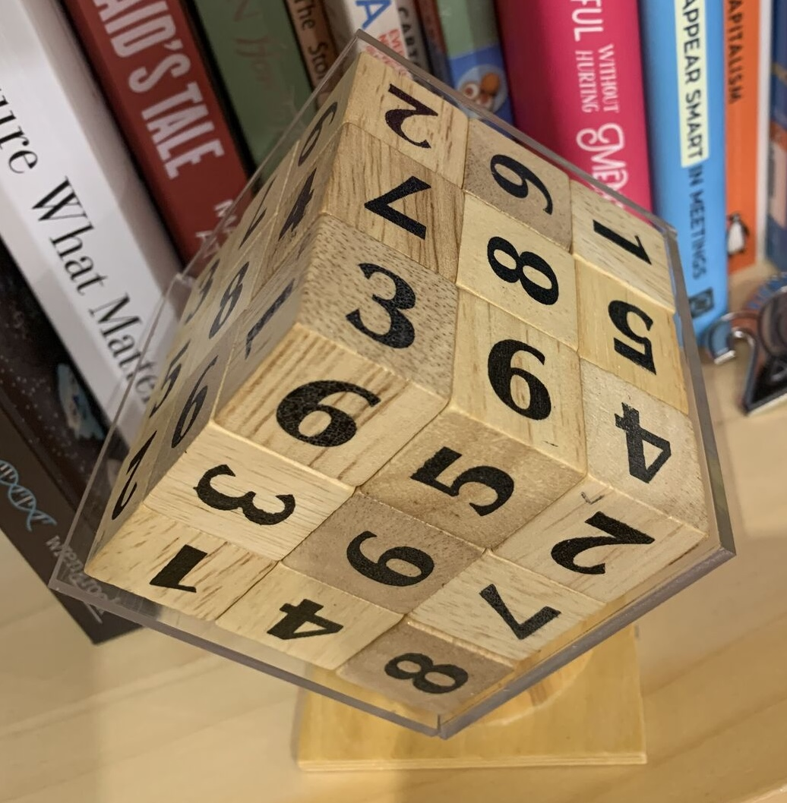

# 3D Sudoku Solver

This is a **backtracking solver for a 3D Sudoku puzzle** - imagine a Rubik's cube where you need to arrange 27 numbered dice so that each face of the 3×3×3 structure shows the digits 1-9 exactly once.

## The Problem

You have 27 small cubes, each with numbers on some faces (or blanks). You need to:
- Place all 27 cubes into a 3×3×3 grid
- Ensure each of the 6 outer faces shows digits 1-9 with no repeats



Note that blank faces of the cubes are hidden on the inside. In other words, there is an exact number of marked, visible faces (6x3x3 = 54). There's:

* one entirely blank cube that is always in the middle
* six centre-face cubes, each with one number marked
* twelve "edge" cubes, with two numbers
* eight "corner" cubes, with three numbers

6s and 9s are not distinguished on the faces. The solver therefore needs to treat 6 and 9 as alternates.

That allows us to see that:
* only certain cubes will fit in a given slot in the grid
* only certain orientations will fit.

We choose a [convention](prototype/marks.py) for numbering the sides of the cube (and the board), and for the number of non-blank faces.

That allows for a simple declaration of the specific [pieces](prototype/3dsudoku.py) in play.

Each of the 24 different rotations, and the 6/9 variants can be easily done [here](prototype/define_cube.py).

## Algorithm

Finding _a_ solution was relatively quick and easy with Python, for example:

```
- 1 3 - - 1 | - 3 - - - 2 | - 7 - 3 - 5 |
- 9 1 - - - | - 4 - - - - | - 5 - 7 - - |
- 2 4 - 2 - | - 8 - - 4 - | - 6 - 5 8 - |

- - 5 - - 4 | - - - - - 3 | - - - 6 - 7 |
- - 7 - - - | - - - - - - | - - - 8 - - |
- - 9 - 5 - | - - - - 9 - | - - - 9 3 - |

1 - 8 - - 8 | 5 - - - - 6 | 3 - - 1 - 9 |
7 - 6 - - - | 8 - - - - - | 6 - - 4 - - |
2 - 2 - 6 - | 4 - - - 7 - | 9 - - 2 1 - |
```

This shows bottom, middle, and top layers. Each cube's faces (e.g. `- 1 3 - - 1`) show in the conventional order of
_top, bottom, left, right, front, back_.

This leads to: how many distinct solutions are there? To find all solutions, use a classic **backtracking search**:

```
For each position in the 3×3×3 grid:
  For each available cube that could fit here:
    For each valid rotation of that cube:
      If it doesn't create duplicate numbers on any face:
        ✓ Place the cube
        ✓ Recursively solve the rest
        ✓ Remove the cube (backtrack)
```

The solver gets the first answer in a fraction of a second. At first I thought there might be a few thousand, or a few million valid solutions that could be found with reasonable runtime. There are many more than that!

## [Prototype](prototype) implementation

Data structures and algorithms were initially built in Python, allowing various algorithm choices to be easily explored.

1. **Pre-filtering** - The `SlotVariants` structure means we only try cubes that:
   - Have the right number of visible faces for that position (corner=3, edge=2, face=1, center=0)
   - Have no blanks on visible faces

1. **Exploit symmetry** - Force the first corner cube to always be a specific choice. After all, the solved "big" cube has full rotational symmetry. This reduces redundant searches by ~24×.

    > If you want to consider each big cube orientation as unique, just multiply the already huge number of solutions by 24.

1. **Early termination** - The `is_valid2()` check immediately rejects placements that would create duplicate numbers

1. **Two solve functions** - `solve_from_pos()` prints progress for the first 8 positions, `solve_from_pos_deep()` runs silently for deeper recursion (avoiding I/O overhead in the tight inner loop)

1. **Linear recursion over positions** - While the puzzle is conceptually a 3×3×3 grid, the solver recurses over a flattened 27-element array (`strip`). The traversal order is z→y→x (so position 0 is grid[0][0][0], position 1 is grid[1][0][0], etc.). This provides better cache locality and simpler indexing (single integer position instead of x,y,z coordinates), making the inner loop faster.

## Need for speed

The next optimization was to use [pypy](https://pypy.org/index.html) instead of the usual Python3 interpreter. This gave ~3x speedup.

## Rust

In late 2024, ChatGPT helped me translate the code into Rust. However, this gave about a ~2.5x compared to Python, probably because I was fighting against the borrow-checker and didn't apply the right optimizations. The Rust version still used hash-based sets rather than bitmasks.

## C++

The problem space fits perfectly into bitmask operations, instead of hash-based sets. 64 bits easily handles both 10 digits and 27 cubes.
In late 2025, CoPilot (Claude Sonnet 4.5) helped translate the Python into C++ with this optimization. This gives a ~20x speedup.

**Bitmasks (uint64_t)** - The key speedup over Python
- Instead of Python sets, uses binary bits to track which numbers/cubes are used
- `sides[6]`: 6 bitmasks tracking which digits appear on each face (each storing 10 bits for digits 0-9)
- `available`: bitmask of which cubes haven't been placed yet (27 bits for cube IDs 0-26)
- Operations like "is 7 already on the top face?" become single CPU-level bitwise operations
- Uses CPU intrinsics (`__builtin_ctzll` for finding first set bit, `__builtin_popcountll` for counting bits) that map directly to hardware instructions
- Much faster than Python set operations due to no hashing overhead and better cache locality

**Additional C++ optimizations:**
- Branch prediction hints (`[[likely]]` attributes) guide the compiler to optimize the most common code paths
- Inline functions eliminate function call overhead in hot loops

The pre-computed variants, state tracking, and other algorithmic optimizations remain the same as the Python prototype.

The result is an optimized constraint satisfaction solver that can explore millions of placements per second.

### Build instructions
I found `clang++` to be slightly faster than `g++` on both Apple M3 (ARM) and Linux/x64 architectures. This works for both:

```bash
clang++ -std=c++20 -O3 -march=native -funroll-loops -fomit-frame-pointer -ffast-math -o 3dsudoku 3dsudoku.cpp
```

## Parallelization Strategy

The solver itself is single-threaded and will saturate a single core. However, to exploit modern multi-core CPUs (and even distribute work across multiple machines), the solver accepts a command-line argument specifying which cube to place at _position 1_ (an edge piece).

Note: Position 0 (grid[0][0][0], a corner) is automatically fixed to break symmetry. Position 1 (grid[1][0][0], an edge) is where we can inject different cubes to partition the problem space.

```bash
./3dsudoku 8   # Force cube #8 at position 1
```

This allows you to divide the problem space across cores or machines by running multiple instances with different hint cube IDs. ID 7 is invalid (the 1s clash) so we only need to try edge piece IDs 8-18. This needs 11 processes.
Each process explores an independent subtree of the search space. The results can be written to different .txt files, see [do_all.sh](do_all.sh).

The results can be summed to get the total solution count.

Each process can be tuned after starting, with `renice` so that, for example, seven processes run with normal priority on seven cores, while the remaining 4 run more slowly (to minimize context switching).

## Checking against Python code

The "Christmas 2024" Python run found ~ 65 billion solutions in just over ten days. A [comparison script](./compare_outputs.py) allows the new run to be checked against this (for cube 8).


```
 ./compare_outputs.py out.txt ./out-cube8.txt
Comparing out.txt vs ./out-cube8.txt
Showing lines with dashcount <= 4
======================================================================
out.txt: 475956 lines
./out-cube8.txt: 244245 lines

Note: Different number of lines - comparing up to shorter length

✓ ---- with - 4 - - - - 427,123,712 solutions | ---- with - 4 - - - - 427,123,712 solutions | 5.69x
✓ ---- with - 8 - - - - 832,529,920 solutions | ---- with - 8 - - - - 832,529,920 solutions | 6.21x
:
: etc
:
======================================================================
✓ No differences found! Outputs match.
```

This shows we haven't broken the C++ version.

## Estimating run-time

A [spreadsheet](estimating/combinations%20of%20first%20layer.xlsx) was used to estimate the expected total run-time. On a 6th-gen Intel i7 x64 machine running all 11 processes simultaneously, just one variant of pos[2] took around 23 hours:

```
out-cube8.txt:-- with - 7 - 3 - 5 	121891.048    65,473,163,264
out-cube9.txt:-- with - 3 - 5 - 7 	80736.92	    38,955,118,592
out-cube10.txt:-- with - 3 - 5 - 7	72396.94	    32,622,742,528
out-cube11.txt:-- with - 7 - 3 - 5	64844.251	    29,704,595,456
out-cube12.txt:-- with - 7 - 3 - 5	41221.292	    17,103,035,136
out-cube12.txt:-- with - 3 - 5 - 7	83229.521	    34,123,643,648
out-cube12.txt:-- with - 4 - 2 - 2	122172.331    46,714,152,192
out-cube13.txt:-- with - 3 - 5 - 7	38352	        16,270,033,408
out-cube13.txt:-- with - 5 - 7 - 3	84768.097	    36,207,573,504
out-cube13.txt:-- with - 4 - 2 - 2	121017.138    48,175,673,600
out-cube14.txt:-- with - 3 - 5 - 7	43167.36	    17,750,680,064
out-cube14.txt:-- with - 5 - 7 - 3	83740.348	    34,752,132,096
out-cube14.txt:-- with - 4 - 2 - 2	121892.865    46,947,904,512
                                                  ==============
                                                 464,800,448,000
```

This is ~5.5 million solutions per second.

Using the Python solver to return early (not going to full depth) shows that for each pos[1], pos[2] has between 28 and 76 valid variations, suggesting ~ 3 months runtime on this machine.

A faster approach:
* match the number of processes to the number of cores on a host (not overloading it)
* minimize context switching - pin the processes to a core - see [do_some.sh](./do_some.sh)
* run on more hosts

This brings the expected runtime down to ~30 days.

## Results (so far)

Starting corner pos[0] = `1 3 1`.

Each pos[1] + pos[2] cube choice gives rise to a certain number of variants to check.

|pos[1] #|Cube Faces|Variants|Results filename|Number of solutions|
|--|--|--|--|--|
|7  |`{1, 9}`|0||0|
|8  |`{3, 2}`|28|out-cube8.txt |963,541,592,064|
|9  |`{7, 5}`|39|out-cube9.txt |744,549,967,872|
|10 |`{4, 5}`|38|out-cube10.txt|747,100,652,544|
|11 |`{4, 8}`|38|out-cube11.txt|717,611,621,376|
|12 |`{5, 9}`|70|out-cube12.txt|727,892,265,472|
|13 |`{6, 5}`|70|out-cube13.txt|727,892,265,472|
|14 |`{7, 6}`|76|out-cube14.txt|728,578,428,928|
|15 |`{3, 9}`|74|out-cube15.txt|875,854,398,464|
|16 |`{7, 4}`|42|out-cube16.txt|743,394,725,888|
|17 |`{7, 9}`|76|out-cube17.txt|728,578,428,928|
|18 |`{4, 6}`|76|out-cube18.txt|722,821,117,952|

Grand total: 8,427,815,464,960 solutions

Due to 6/9 ambiguity, cubes #12 and #13 are equivalent, as are cubes #14 and #17.

The [summarize_all.py](./summarize_all.py) program adjusts for some issues with the logging output during development, [summary.txt](./summary.txt) shows the output of adjusted counts.


